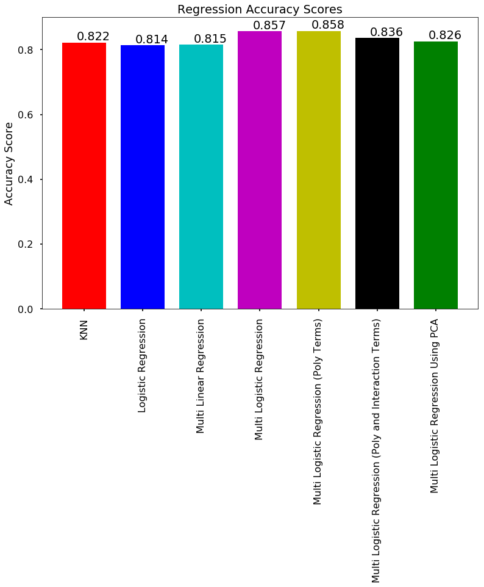

#### By Alexandra Abrahams and Kahunui Foster
Group #28
TF: Cindy Zhao

CS109A Introduction to Data Science, Fall 2017, Harvard University

# Final Project Report

#### Contents:
* [Problem Statement and Motivation](/cs109a/#problem-statement-and-motivation)
* [Introduction and Description of Data](/cs109a/#introduction-and-description-of-data)
* [Literature Review / Related Work](/cs109a/#literature-reviewrelated-work)
* [Modeling Approach and Project Trajectory](/cs109a/#modeling-approach-and-project-trajectory)
* [Results, Conclusions, and Future Work](/cs109a/#results-conclusions-and-future-work)

### Problem Statement and Motivation

We aim to build a model that predicts the popularity of a Spotify playlist given information about the constituent songs of that playlist. Spotify is one of the world's largest music subscription companies, with about 100 million users. The majority of those do not pay a subscription, however, and the company profits from these users by inserting advertisements between tracks. Therefore the company has a business motive to create playlists which attract more users to them, since listeners to a playlist means more opportunities to show advertisements. On a personal level, using data science to predict something as innately human as what music we like just seemed like a very interesting challenge to us. We use the number of followers of the playlist as our measure of the playlist's popularity, and in the data collection section we will explain what variables we used as predictors.

### Introduction and Description of Data

Given that we predict that a playlist is popular, we would like the chances to be high that it actually is popular. Hence we seek to create a model that has a low false positive rate. We also want to balance this aim with a desire to return a diversity of playlists as popular; if we are only predicting a few playlists as popular then our model would not be very useful for Spotify executives creating playlists. We further explore the implications of this preference for one type of error over another in our model in the modeling section.

Preliminary EDA indicated that there were large outliers in the dataset for the number of playlist followers. The followers variable does not have a normal distribution in the dataset, and instead it is skewed with a right tail. Most playlists had a number of followers below a low value, but there were a few playlists which entirely skewed the data. This caused us to think differently about what it meant for a playlist to be popular, if very few playlists actually achieve stratospheric popularity. We decided to formulate our question towards determining whether a playlist will reach a certain level of popularity, rather than predicting the exact number of followers it will achieve.

Several of the variables, such as total duration, appear to have quadratic rather than linear relationships with the response variable. This caused us to brainstorm modeling ideas that would allow us to also incorporate other variables that appeared to have linear relationships with the followers variable, such as average loudness. Visualizations and further details on the findings from EDA can be found in the EDA notebook.

##### Brief overview of the data collection process

The data was collected using the following steps:
1. We used the [Spotipy API wrapper](http://spotipy.readthedocs.io/en/latest/) to collect the basic information of a set of about 1,700 public Spotify-owned playlists.
  An additional step was required here to get the full information of each of the above playlists, corresponding to the ‘full’ object rather than the simplified version with fewer fields. The full object gave access to a list of the tracks in that playlist, and data about the playlist such as the number of end followers. Some of these playlists failed to carry basic information, and the overall number was reduced.

2. For each of the above playlists, our program iterated through the list of tracks in that playlist and for each track collected [audio analysis information](https://developer.spotify.com/web-api/get-audio-features/) such as ‘danceability’. While looping through each track, the program also collected the genre information of the track’s artist. However, each artist has multiple genres, which Spotify has organized alphabetically rather than by relevance. Therefore all the genres were added to the track to impute it's genre.

3. Finally, the set of JSON objects was turned into a CSV spreadsheet, where each row corresponded to a playlist and the audio analysis information contained in each track was aggregated into average values for that playlist, such as average danceability. A playlist's genre was imputed from the set of genres available for that playlist's tracks, which was in turn derived from the track's artist. A playlist's genre is therefore simply the most commonly-occurring genre amongst the set of genres collected across all tracks in the playlist, where each track has multiple genres. This is not an ideal process since an artist can work in a diverse area of genres, but the alternative was to work with a smaller dataset of about 800 playlists which were directly assigned categories by Spotify. When we evaluated the trade-off between more data or more accurate genre data, we chose the former.

The result of this process was about 1,500 playlists. Roughly 142 of these playlists had no tracks with any associated genre in their artist, and therefore they were dropped. In addition, the original data collected from Spotify contained about 270 unique genres. We manually mapped each genre to a meta-genre, as we could not find a reliable computer-driven method to do so, and replaced the subgenres with these meta-genres. The mapping between these 278 original genres to the 23 meta-genres (not counting None, which was deleted from the dataset) is given in the table [on this page](/cs109a/meta_mapping.html).

The following table describes the features that were contained in our dataset at the time that we began modeling. The descriptions of the audio features are quoted directly from the [Spotify API documentation](https://developer.spotify.com/web-api/get-audio-features/).

##### Features of our dataset

| Feature                  | Description                                                                                                                                                                                                                                                                                                                                              |
|--------------------------|----------------------------------------------------------------------------------------------------------------------------------------------------------------------------------------------------------------------------------------------------------------------------------------------------------------------------------------------------------|
| Playlist name            | Name of the Spotify playlist. While retained in the dataset to allow further fetches to the Spotify API, it was not actually used in the statistical model.                                                                                                                                                                                                                                                                                                                            |
| Playlist ID              | Unique ID given by Spotify to the playlist. While retained in the dataset to allow further fetches to the Spotify API, it was not actually used in the statistical model.                                                                                                                                                                                |
| Followers                | The number of followers subscribed to the playlist.                                                                                                                                                                                                                                                                                                      |
| Average danceability     | Danceability describes how suitable a track is for dancing based on a combination of musical elements including tempo, rhythm stability, beat strength, and overall regularity. A value of 0.0 is least danceable and 1.0 is most danceable. The average danceability is the danceability value averaged across all the songs in the playlist.           |
| Average energy           | Energy is a measure from 0.0 to 1.0 and represents a perceptual measure of intensity and activity. The average energy is the energy value averaged across all the songs in the playlist.                                                                                                                                                                 |
| Average key              | Key means the key the track is in. Integers map to pitches using standard [Pitch Class notation](https://en.wikipedia.org/wiki/Pitch_class). E.g. 0 = C, 1 = C♯/D♭, 2 = D, and so on. The average key is the key value averaged across all the songs in the playlist.                                                                                    |
| Average loudness         | Loudness is the overall loudness of a track in decibels (dB). Loudness values are averaged across the entire track and are useful for comparing relative loudness of tracks. Values typical range between -60 and 0 db. The average loudness is the loudness value averaged across all the songs in the playlist.                                        |
| Average mode             | Mode indicates the modality (major or minor) of a track, the type of scale from which its melodic content is derived. Major is represented by 1 and minor is 0. The average mode is the mode value averaged across all the songs in the playlist, and then set to 0 if less than 0.5 and 1 otherwise.                                                    |
| Average speechiness      | Speechiness detects the presence of spoken words in a track. The more exclusively speech-like the recording (e.g. talk show, audio book, poetry), the closer to 1.0 the attribute value. The average speechiness is the speechiness value averaged across all the songs in the playlist.                                                                 |
| Average acousticness     | Acousticness is a confidence measure from 0.0 to 1.0 of whether the track is acoustic. 1.0 represents high confidence the track is acoustic. The average acousticness is the acousticness value averaged across all the songs in the playlist.                                                                                                           |
| Average instrumentalness | Instrumentalness predicts whether a track contains no vocals. "Ooh" and "aah" sounds are treated as instrumental in this context. The closer the instrumentalness value is to 1.0, the greater likelihood the track contains no vocal content. The average instrumentalness is the instrumentalness value averaged across all the songs in the playlist. |
| Average liveness         | Liveness detects the presence of an audience in the recording. Higher liveness values represent an increased probability that the track was performed live. The average liveness is the liveness value averaged across all the songs in the playlist.                                                                                                    |
| Average valence          | Valence is a measure from 0.0 to 1.0 describing the musical positiveness conveyed by a track. Tracks with high valence sound more positive. The average valence is the valence value averaged across all the songs in the playlist.                                                                                                                      |
| Average tempo            | The overall estimated tempo of a track in beats per minute (BPM). The average tempo is the tempo value averaged across all the songs in the playlist.                                                                                                                                                                                                    |
| Average time signature   | An estimated overall time signature of a track. The time signature (meter) is a notational convention to specify how many beats are in each bar (or measure). The average time signature is the time signature value averaged across all the songs in the playlist.                                                                                      |
| Average duration         | Average duration of songs in that playlist, in milliseconds.                                                                                                                                                                                                                                                                                             |
| Total duration           | Total duration of the playlist, in milliseconds.                                                                                                                                                                                                                                                                                                         |
| Total number             | Total number of songs in the playlist.                                                                                                                                                                                                                                                                                                                   |
| Genre                    | The genre of the playlist, as imputed by the process detailed in this report.                                                                                                                                                                                                                                                                            |
| Maximum popularity       | The maximum popularity score of any song in the playlist. The [popularity](https://developer.spotify.com/web-api/get-track/) of the track is a value between 0 and 100, with 100 being the most popular.                                                                                                                                                 |
| Average popularity       | The average popularity score of the songs in the playlist. The [popularity](https://developer.spotify.com/web-api/get-track/) of the track is a value between 0 and 100, with 100 being the most popular.

## Literature Review/Related Work

To understand where the Spotify playlist sits in the world of music, we found an [insightful article](https://www.wired.com/2017/05/secret-hit-making-power-spotify-playlist/) about how these playlists are used by artists and labels to shoot songs up to the top of the hit song list. The article informed us that the metrics to categorize Spotify playlists are getting more and more complicated, with new genres being added and playlists being meticulously curated for individual needs. Here, we were inspired to make sure we paid careful attention to the predictors we used and tried to relate them to some of the trends in the article, which states that playlists such as “Today’s Top Hits” and “Rap Caviar” are among the top playlists on Spotify.

The next article that proved helpful was one consisting of a hand-picked [top 25 best playlists on Spotify](https://www.digitaltrends.com/music/best-playlists-on-spotify/). This article was a delve into the everyday nature of a playlist, and allowed us to see the true variation found in many popular playlists. Looking through the 25 playlists helped us to pick which genres we would want to classify our playlists under as well as helped us understand better what we were aiming to classify, a fully curated popular playlist.

The [last article](https://www.thrillist.com/tech/nation/how-to-find-great-spotify-playlists) we found was extremely helpful in painting a better picture of the user’s interaction when picking a playlist which we then used as a basis for how our model should work. Since many of the most popular playlists on Spotify are curated directly by Spotify users, it was insightful to know some practices they have when it comes to creating a popular playlist, such as using Spotify’s “Discover Weekly”. We found that while the data we have does not allow for incredible creativity, a tip from the article called for creating themed playlists, which was in our capacity since we had the genre predictor.

## Modeling Approach and Project Trajectory

Before beginning any modeling we applied one-hot encoding to the genre predictor so that each genre had a binary column indicating the presence or absence of that column, with a default genre of 'ambient'. We also normalized the predictors to be between 0 and 1, since some of the variables had very different scales (for example, average loudness is a value in decibels between -60 and 0). We split the data into training and test sets.

We initially ran a simple linear regression using only the variable Maximum Popularity, with the aim of designating a baseline model upon which we could improve. We found that it achieved a R2 score of only 0.06 and a mean squared error (MSE) of 337,266,472,892.05, which is obviously extremely high. When we ran a multiple linear regression with some of the other predictors, or even all of them, we found similarly poor results, with the model only reaching a R2 score of about 0.1. These models were not successful at using the given features to predict the number of followers a playlist would garner.

These results caused us to rethink our approach to modeling popularity. We shifted our focus towards predicting whether or not a playlist is popular, rather than predicting a specific number of followers. **We decided that a playlist shall be considered 'popular' if it has at least 250,000 followers, and 'unpopular' otherwise**. The number 250,000 was chosen because the average follower count is about 220,000, and we decided that a playlist can be considered popular if it has significantly above the average number of followers. However, due to the skewedness caused by some outliers, roughly 80% of the dataset was below this average follower count number. Therefore our definition of 'popular' has quite a high threshold (we address this further at the end of this section).

Thus we moved from a continuous response variable to a classification problem, which forced us to think about what kinds of classification errors we were willing to accept. Our model could make two kinds of errors:

* a false positive (an unpopular playlist was falsely predicted to be popular)
* or a false negative (a popular playlist was falsely predicted to be unpopular)

Before beginning to build further models, we asked ourselves whether one kind of error was more palatable to us than the other, and if so which type. We reasoned that if our particular goal is to return popular playlists, then we want to be quite certain that if we return a playlist it actually is popular. This means that we want a high true positive rate. It also means that we mind less if we falsely classify a popular playlist as unpopular. We decided to make this our particular aim, within the overarching goal of having an accurate model across both types of errors.

An economic rationale for this aim is that since a company like Spotify might have to invest considerable resources to license songs from artists, if we advise the company to pay those licensing fees to bring the playlist to their users then we should be quite sure of recouping the cost from showing advertising to a lot of followers. It is less painful if we neglect to find a promising playlist that would have done well, than if we cause the company to lose a lot of money on licensing songs for a playlist that users rarely listen to.

We built a series of models both linear and logistic, and found that logistic models had better accuracy scores than other models. The multiple logistic regression had a test accuracy score of 85% and a false positive rate of 5%. The true positive rate was 48%. However, overall it was predicting very few playlists to be popular, which means that it was only achieving the desired type of accuracy by being very conservative in its guesses.

As mentioned in previous sections, we had noticed during EDA that some terms reach a peak and others are linear in their association with the followers end variable. Therefore we built a model that incorporated polynomial terms to degree 2, which achieved almost identical accuracy scores and true positive rate as the previous model. When we added interaction terms between the continuous variables and the binary genre variables, the test accuracy score decreased to 83%.

We conducted a confidence interval analysis to discover which variables were actually affecting the model. We found that Average Loudness, Average Popularity, Christmas Genre, Comedy Genre, Oldies Genre, Punk Genre, Soul Genre, Speech Genre, and the square of the Average Loudness were all significant under this model. We also tried a different method of reducing the number of variables by fitting a model using the principal components that explained 90% of the variance, but found that this also achieved a similar test accuracy score of about 84%.

Having achieved a model with a decent accuracy score, we tried to extend the model to make it more specific in its prediction. Recall that a playlist is designated as popular if it reaches 250,000 followers. This excludes about 80% of the dataset, which is why the accuracy for each class was so different. We attempted to fix this issue by reworking our data and models for three classes; unpopular, popular, and very popular. Unpopular playlists had between 0 and 90,000 followers, popular playlists had between 90,000 and 225,000 followers, and very popular playlists had more than 225,000 followers. These threshold corresponded to the 65th and 80th percentiles, ensuring a decent distribution of data to each class (but retaining the characteristic that most playlists are unpopular). Multiple logistic regression models with this class system were at about 72%, and we found that while the true positive rate for unpopular playlists remained high at 91%, for both popular and very popular playlists it was only about 2% for each. Therefore we do not consider this to be a good model for finding popular playlists.

From the graph below we can compare the various models that were built during this project. Although the multiple logistic regression model with quadratic terms has a marginally better test accuracy score, for ease of interpretation we will use the multiple logistic regression model without the quadratic terms.

## Results, Conclusions, and Future Work

Full details of the final model can be found in the models notebook. However, we discuss here the implications of the chosen model, namely a multiple logistic regression model.
* Quantitative prediction very difficult, and low R^2 score indicates that simply computational variables cannot fully explain what makes a good playlist
* Future work would include work using the year
* Themed years and playlists and special work around themes like Christmas playlists
* Music curators' jobs are safe from the machines for now.

Extension: try to produce a rock playlist using the popularity of individual songs to get to the best possible average popularity; just grab the most popular songs in that genre.
